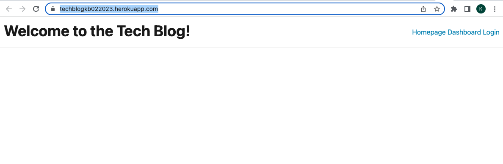

# The Tech Blog
User will use deployed application to interface with a CMS-style blog that publishes articles, blog posts, and user thoughts and opinions.  

## Description
This application allows users to dynamically navigate CMS blog including signing up for account, login, creating blog posts and commenting on other blogs. This application follors the MVC paradigm with use of Handlebars.js, Sequelize and express session for authentication. 

[GitHub Repo](https://github.com/kristinbrewer/tech-blog)

[Deployed App](https://techblogkb022023.herokuapp.com/)

## Table of Contents
- [Description](#description)
- [Installation](#installation)
- [Usage](#usage)
- [License](#license)
- [Contributing](#contributing)
- [Tests](#tests)
- [Questions](#questions)

## Installation
Node.js (v16), MySQL, Express.js, Sequelize, express-handlebars, express-session, Heroku

## Usage
Use Heroku application

## License
MIT Copyright (c) 2022 kristinbrewer
Permission is hearby granted, free of charge, to any person obtaining a copy of this software and associated documentation files (the "Software"), to deal in the Software without restriction, including without limitation the rights to use, copy, modify, merge, publish, distribute, sublicense, and/or sell copies of the Software, and to permit persons to whom the Software is furnished to do so, subject to the following conditions: The above copyright notice and this permission notice shall be included in all copies or substantial portions of the Software. THE SOFTWARE IS PROVIDED ”AS IS”, WITHOUT WARRANTY OF ANY KIND, EXPRESS OR IMPLIED, INCLUDING BUT NOT LIMITED TO THE WARRANTIES OF MERCHANTABILITY, FITNESS FOR A PARTICULAR PURPOSE AND NONINFRINGEMENT. IN NO EVENT SHALL THE AUTHORS OR COPYRIGHT HOLDERS BE LIABLE FOR ANY CLAIM, DAMAGES OR OTHER LIABILITY, WHETHER IN AN ACTION OF CONTRACT, TORT OR OTHERWISE, ARISING FROM, OUT OF OR IN CONNECTION WITH THE SOFTWARE OR THE USE OR OTHER DEALINGS IN THE SOFTWARE. 

## Contributing
Kristin Brewer

## Tests
N/a

## Questions
For more information, my GitHub account is: [kristinbrewer](https://github.com/kristinbrewer).
Please email me at: brewer.kristin17@gmail.com with any additional questions. 